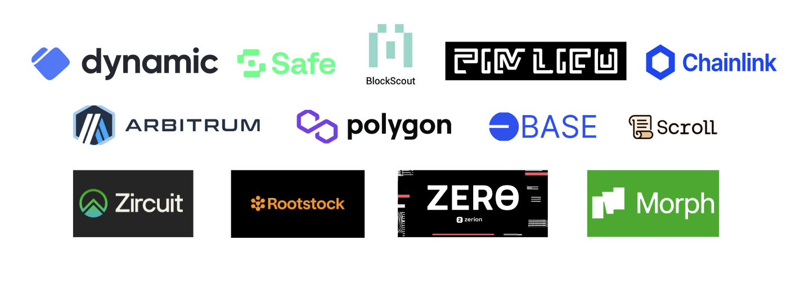

#  🏗 Scaffold-ETH 2 (Hackathon Starter Kit Version)



<h4 align="center">
  <a href="https://www.youtube.com/watch?v=dkONR9dJD2g">Video Walkthrough</a>
</h4>

🧪 An open-source, up-to-date toolkit for building decentralized applications (dapps) on the Ethereum blockchain. It's designed to make it easier for developers to create and deploy smart contracts and build user interfaces that interact with those contracts as well as add EthGlobal partner technology such as account abstraction, chain abstraction, onboarding, transaction exploring, EVM networks, custom chains and much more!

## Requirements

Before you begin, you need to install the following tools:

- [Node (>= v18.17)](https://nodejs.org/en/download/)
- Yarn ([v1](https://classic.yarnpkg.com/en/docs/install/) or [v2+](https://yarnpkg.com/getting-started/install))
- [Git](https://git-scm.com/downloads)

- You have to get a [Pimlico API key](https://dashboard.pimlico.io/sign-in) and put it in your env file (`NEXT_PUBLIC_PIMLICO_API_KEY`).
- You have to get a [Lighthouse Storage API key](https://docs.lighthouse.storage/lighthouse-1/how-to/create-an-api-key) and add it to the env file(`NEXT_PUBLIC_LIGHTHOUSE_API_KEY`)

- You should send some ERC20 (USDC is better) to your Safe smart wallet in order to use the transfer and cross-chain transfer capabilities.

- You can use the default Dynamic environment ID to test, but we recommend you add your own as soon as possible in the env file (NEXT_PUBLIC_DYNAMIC_ENVIRONMENT_ID)

## Quickstart

To get started with Scaffold-ETH 2 Hacker Edition, follow the steps below:

1. Clone this repo & install dependencies

```
git clone https://github.com/dynamic-labs/hackathon-starter-kit
cd hackathon-starter-kit
yarn install
```

2. Run a local network in the first terminal:

```
yarn chain
```

This command starts a local Ethereum network using Hardhat. The network runs on your local machine and can be used for testing and development. You can customize the network configuration in `hardhat.config.ts`.

3. On a second terminal, deploy the test contract:

```
yarn deploy
```

This command deploys a test smart contract to the local network. The contract is located in `packages/hardhat/contracts` and can be modified to suit your needs. The `yarn deploy` command uses the deploy script located in `packages/hardhat/deploy` to deploy the contract to the network. You can also customize the deploy script.

4. On a third terminal, start your NextJS app:

```
yarn start
```

Visit your app on: `http://localhost:3000`. You can interact with your smart contract using the `Debug Contracts` page. You can tweak the app config in `packages/nextjs/scaffold.config.ts`.


## Features Overview

⚙️ Built using NextJS, Dynamic, Hardhat, Wagmi, Viem, and Typescript.

- ✅ **Contract Hot Reload**: Your frontend auto-adapts to your smart contract as you edit it.
- 🪝 **[Custom hooks](https://docs.scaffoldeth.io/hooks/)**: Collection of React hooks wrapper around [wagmi](https://wagmi.sh/) to simplify interactions with smart contracts with typescript autocompletion.
- 🧱 [**Components**](https://docs.scaffoldeth.io/components/): Collection of common web3 components to quickly build your frontend.
- 🔥 **Burner Wallet & Local Faucet**: Quickly test your application with a burner wallet and local faucet.


- 🤝 **Dynamic onboarding**: Provides an interactive and responsive widget for interacting with your embedded wallet. You can create your embedded wallet using social logins or connecting an existing wallet.
- 🔥 **Safe Smart Wallet**: Provides the most battle-tested ERC-4337 compatible smart wallet, improving users' UX.
- 📱 **Permissionless.js (Pimlico) for gasless transactions**: Facilitates transactions without requiring users to pay gas fees. Pimlico is the world's most popular ERC-4337 account abstraction infrastructure platform.
- ⛓ **Chainlink CCIP for cross-chain transactions**: Enables seamless transfers across different blockchain networks.
- 🔗 **Blockscout for checking transactions**: Allows users to track and verify their transactions.

### Chains & Networks
Out of the box with the Dynamic implementation you get:

- Base
- Arbitrum
- Polygon
- Scroll
- Zircuit
- Rootstock
- ZERϴ
- Morph

You can add many more via [the dashboard](https://app.dynamic.xyz/dashboard/chains-and-networks), or using [custom EVM Networks](https://docs.dynamic.xyz/chains/evmNetwork)!

*This means you can instantly plug in any local chain you have running, like from Arbitrum Orbit, Polygon CDK etc!*

### Safe Smart Wallet and Permissionless.js (Pimlico)

Navigate to the "Smart Wallet" section and click on "Deploy Safe Account".
This action calls the `createSmartAccountClient` function from Permissionless.js. More details can be found [here](https://docs.pimlico.io/permissionless/how-to/signers/privy#create-the-smartaccountclient).
The Safe address is calculated deterministically based on your Dynamic embedded wallet address.
The actual deployment of the Safe wallet occurs when you initiate your first transaction, such as a transfer.

#### Executing a Transfer:
You can perform a transfer of ERC-20 tokens in a gasless way. The app uses `smartAccountClient.writeContract` from Permissionless.js ([source](https://docs.pimlico.io/permissionless/reference/smart-account-actions/writeContract)). This allows for gasless transfers, sponsored by the Pimlico Paymaster on testnets.
ERC-20 transfers are supported on any chain supported by Pimlico. Refer to the supported chains documentation [here](https://docs.pimlico.io/infra/bundler/bundler-errors/chain-not-supported#adding-new-chains).

### Chainlink CCIP for Cross-Chain Transactions

A custom Chainlink CCIP cross-chain transfer smart contract has been deployed, allowing for USDC (only!) transfers.
The contract has ETH on Base Sepolia to cover CCIP fees.
Contract address: `0x480A24B3F71f8704066211e61CF6CCE430B8a5c7`. You can find it in the `constants.ts` file of the project.
Check the contract code: you can find the code in `/hardhat/contracts/CCIPTransfer.sol`.
Check the contract ABI: you can find the contract ABI in `/nextjs/lib/ABI`.
The reference of the contract is this Chainlink CCIP contract example ([source](https://docs.chain.link/ccip/tutorials/cross-chain-tokens)).

The app uses `smartAccountClient.writeContract` ([source](https://docs.pimlico.io/permissionless/reference/smart-account-actions/writeContract)) of Permissionless.js to ensure gasless cross-chain transactions.
The implementation is flexible, allowing for easy extension to support additional chains or rewriting the contract.
If your allowance is lower than the amount to transfer, you are asked to execute an approve too.

### Blockscout for Checking Transactions

In the "Transactions" section, users can view all transactions executed by the Safe smart wallet within the session. The app integrates the [Blockscout API](https://docs.blockscout.com/for-users/api) to fetch and display transaction details, providing a transparent and user-friendly way to track activities.


## Further Documentation
- [Dynamic](https://docs.dynamic.xyz/)
- [Original Scaffold Eth 2](https://scaffold-eth-2-docs.vercel.app/)
- [Pimlico](https://docs.pimlico.io/)
- [Safe](https://docs.safe.global/)
- [Chainlink](https://docs.chain.link/)
- [Blockscout](https://docs.blockscout.com/for-users/api/rpc-endpoints)
